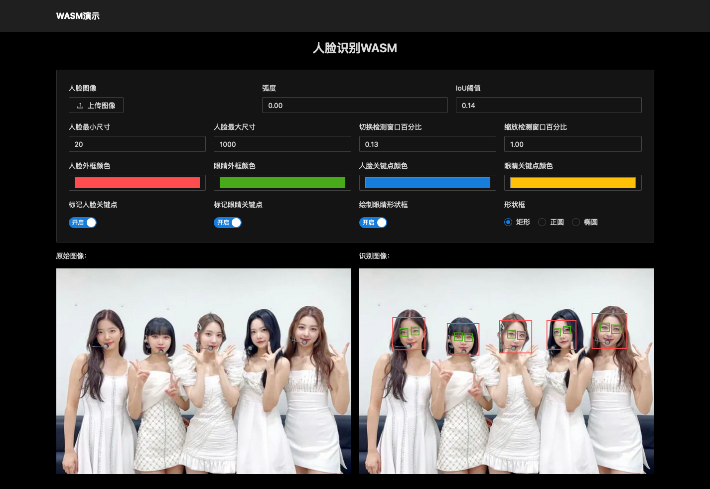
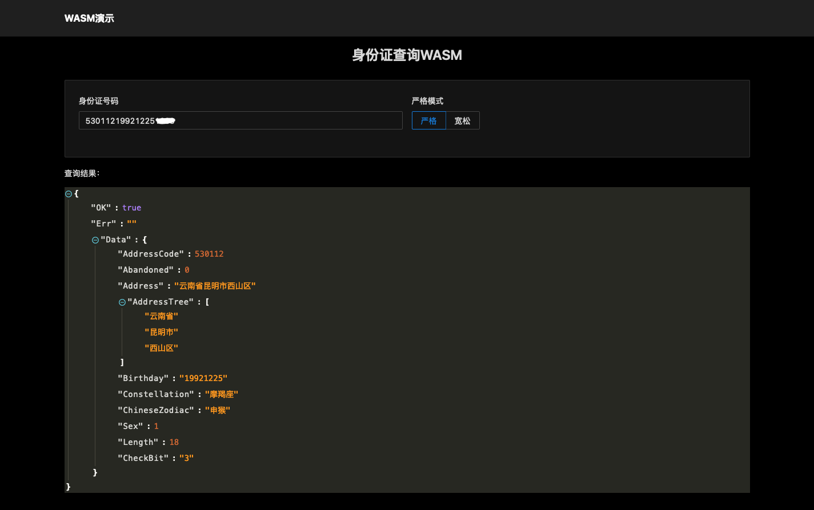
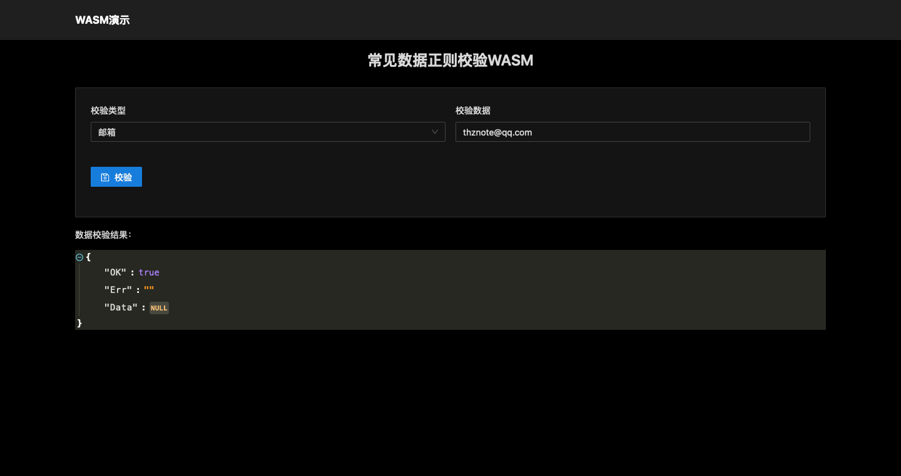

#### 一、WASM加载

```js
// 引入wasm_exec.js
const go = new window.Go();

const initInstantiate = (obj) => {
    go.run(obj.instance).then();
}

// url->wasm地址
const initWasm = (url) => {
    if ('instantiateStreaming' in WebAssembly) {
        WebAssembly.instantiateStreaming(fetch(url), go.importObject).then(initInstantiate);
    } else {
        fetch(url).then(resp => resp.arrayBuffer()).then(bytes => WebAssembly.instantiate(bytes, go.importObject).then(initInstantiate))
    }
}

// 加载wasm
initWasm("xxx/xxx/xxx.wasm")
```

#### 二、WASM文档

- 最新版本v0.0.4，下载地址：https://github.com/rustgopy/wasm/releases

<details>
  <summary>1.人脸识别WASM</summary>

```js
// 初始化加载图片
window.InitTestImage(JSON.stringify({Img: Array.from(imageByte)}))

// 识别
let params = JSON.stringify({
    Shape: shape, // 形状框：rect（正方形）、circle（圆形）、ellipse（椭圆）
    FaceParam: {
        Angle: angle, // 弧度：0.0~1.0，默认0.0
        MinSize: minSize, // 人脸最小尺寸：20
        MaxSize: maxSize, // 人脸最大尺寸：1000
        ShiftFactor: shiftFactor, // 按百分比切换检测窗口，0.15
        ScaleFactor: scaleFactor, // 按百分比缩放检测窗口，1.15
        IouThreshold: iouThreshold, // 联合交叉口（IoU）阈值，0.15
        MarkLlpLoc: markLlpLoc, // 是否开启面部关键点定位分类器，bool类型
        MarkDetEyes: markDetEyes, // 是否标记检测眼睛，bool类型
        MarkPup: markPup, // 是否定位眼睛，bool类型
        ColorRectFace: colorRectFace, // 人脸外框颜色，例如：#abcdef
        ColorRectEye: colorRectEye, // 眼睛外框颜色，例如：#abcdef
        ColorPointFace: colorPointFace, // 人脸关键点颜色，例如：#abcdef
        ColorPointEye: colorPointEye, // 眼睛关键点颜色，例如：#abcdef
    }
})
let res = window.FaceReCog(params);
```



</details>

<details>
  <summary>2.头像生成器WASM</summary>

```js
// sex->性别
// name->昵称
window.GenerateAvatar(sex, name)
```


</details>

<details>
  <summary>3.汉字转拼音WASM</summary>

```js
// hans->汉字
window.Hans2PinYin(hans)
```


</details>

<details>
  <summary>4.IP定位WASM</summary>

```js
// ip->IP地址
window.Search(ip)
```


</details>

<details>
  <summary>5.手机号归属地WASM</summary>

```js
// phone->手机号
window.ChinaPhone(phone)
```


</details>

<details>
  <summary>6.身份证查询WASM</summary>

```js
// idCard->身份证号码
// isStrict->严格模式：开启、关闭
window.ChinaIDCard(idCard, isStrict)
```



</details>

<details>
  <summary>7.HTTPS证书自签名生成器WASM</summary>

```js
let params = JSON.stringify({
    "country": "中国", // 国家
    "province": "云南省", // 省份
    "locality": "昆明市", // 城市
    "street_address": "官渡区矣六街道", // 街道
    "postal_code": "650000", // 邮编
    "organization": "汇聚云南特产", // 公司
    "organizational_unit": "市场部", // 部门
    "common_name": "www.rustgopy.com", // 域名
    "date": "2024-12-31" // 截止日期
})
window.GenerateCA(params)
```


</details>

<details>
  <summary>8.常见数据正则校验WASM</summary>

```js
// cate->分类：date（日期）、email（邮箱）、phone（手机号码）、telephone（电话号码）、postcode（邮政编码）、qq（QQ号码）、ipv4（IPv4地址）、ipv6（IPv6地址）、ip（IP地址）、mac（MAC地址）、url（URL地址）、domain（域名）、resident-id（身份证号码）、bank-card（银行卡号码）
// data->数据
window.CheckData(cate, data)
```



</details>

<details>
  <summary>9.MarkDown文档转HTML代码WASM</summary>

```js
// content->markdown文本内容
window.MarkdownToHtml(content)
```


</details>

<details>
  <summary>10.八卦加解密算法WASM</summary>

```js
// 加密：textPlain->明文
window.BgEn(textPlain)

// 解密：textSecret->密文
window.BgDe(textSecret)
```


</details>

#### 三、联系作者

- 作者：张金龙
- 微信：rustgopy
- Q Q：1780316635
- 邮箱：thznote@qq.com
- 博客：www.rustgopy.com
- GitHub：github.com/rustgopy

#### 四、我的媒体

- [我的B站](https://space.bilibili.com/477557902)
- [我的CSDN](https://edu.csdn.net/lecturer/2759)
- [我的虎课网](https://huke88.com/teacher/21640415.html)
- [我的课课家](https://www.kokojia.com/school-10076699.html)
- [我的腾讯课堂](https://thz.ke.qq.com/)
- [我的网易云课堂](https://study.163.com/provider/1026051425/course.htm)
- [我的51CTO学堂](https://edu.51cto.com/lecturer/14114771.html)

#### 五、微信二维码


#### Stargazers over time

[](https://starchart.cc/rustgopy/wasm)
